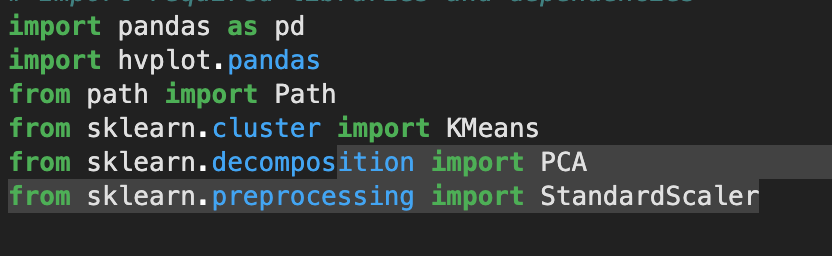
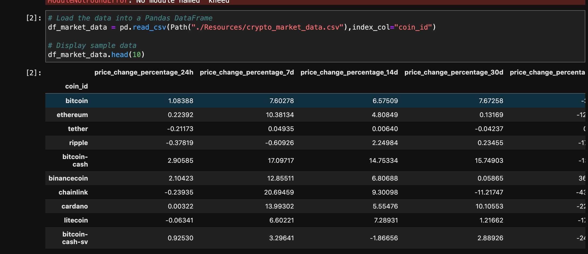
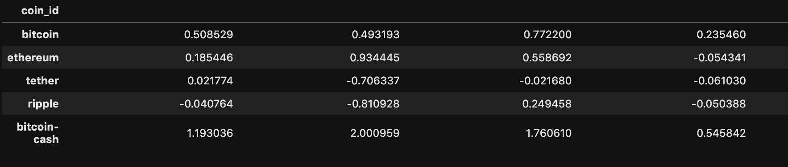
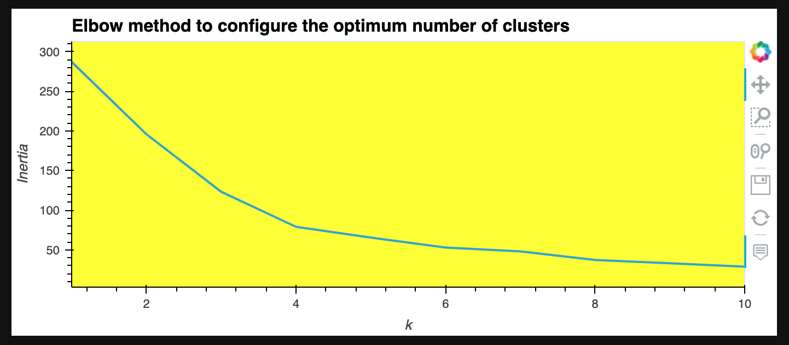
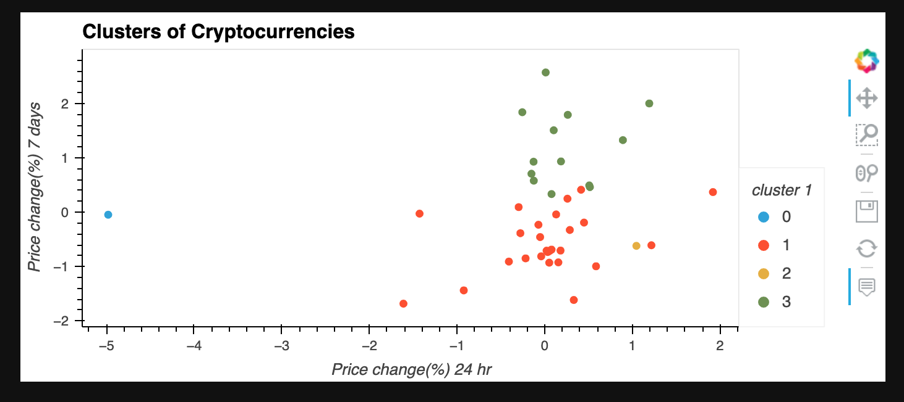
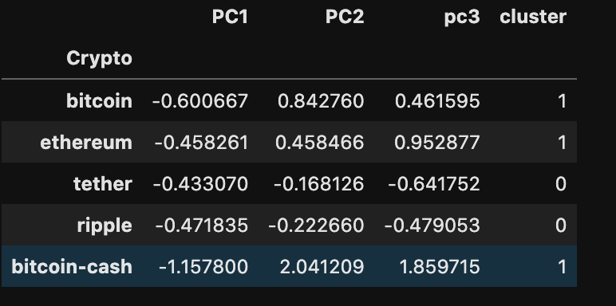

# Week-10-Crypto-Cluster-Unsupervised-Machine-Learning

Unsupervised machine learning is a type of algorithm set that delves into large pool of data and recorgnizes any patterns or provide informations that might exist. Therefore, in this challange, we have a portfolio of crypto currencies and a range of trading data. Our goal here is to use algorithmic tools associated with unsupervized machine learning, to create clusters of data with similar features.

Centroid, a collective mean of the data points with cloer variance to the mean, would be used to create clusters/groups. The variance, here, is one of the key indicators that offers us insight into the data.

---

Technology:

We used Jupyterlab to write the python script.

We had to import different libaries and functions to help us chissle the data to be useful. The libraries include hvplot for visualization, pandas for data manipulation, functions like KMeans, PCA, StandardScaler to help us us the machine learnning algorithm.

Below is an image that lists the functions that were called upon :

---
Usage:

*First we extract the data using from CSV 

*Then we trasnform the data into normal distribution

*Optimum number of clusters can be figured using elbow method. Elbow method displays the level of inertia at different number of clusters. Lower level of interia is prefered to the one thats higher, suggesting that the number of clusters divides the data into groups with similar variances.

*Based on the number we recieved from the elbow method, we can create the number of clusters, and check how the data are catagorized under different clusters.

*Nevertheless we can also reduce the number of features to focus on combination of features that provide the best insight into how those data points behave. Here, we use PCA for the purpose. PCA removes variables that contribue the least towards expalining the data. On the other hand, the variables it creates are able to explain the data sets effectively.

]

---
Contributor:
Babin Shrestha